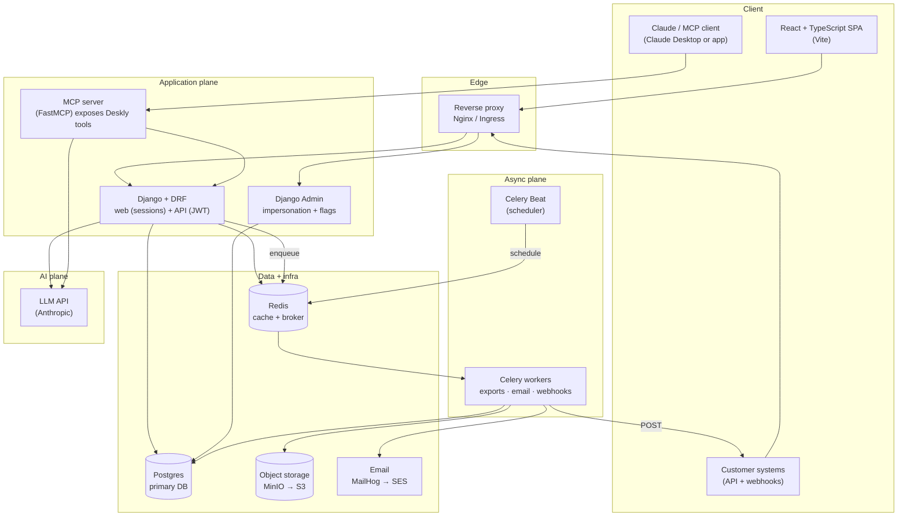

# Deskly — architecture

Show the learner this early and return to it at the start of each phase so they see where the new piece fits. The topology is intentionally identical locally (Docker Compose) and in the cloud (Kubernetes) — only the backing services swap (MinIO→S3, MailHog→SES, local Postgres→RDS).

## System diagram

If the learner can't render Mermaid, describe it: requests enter through a reverse proxy; the Django app handles both the session-based web app and the JWT-based public API; slow or scheduled work (exports, email, webhook delivery) is pushed onto a Redis queue and handled by Celery workers out of band; an MCP server and an in-app assistant form a separate AI plane; Postgres/Redis/object-storage/email are the backing services that swap between local and cloud.

## Why each piece exists (the teaching version)

- **Reverse proxy** — one front door: TLS termination, routing `/api` vs the SPA's static files, and a natural place for rate limiting later. Locally it can be Nginx or even Vite's dev proxy; in K8s it's an Ingress.
- **Django + DRF** — the monolith that owns business rules and data. DRF gives us serializers, viewsets, auth classes, and browsable/OpenAPI docs for free. A monolith is the *right* call for a learning lab — you see the whole system in one place before splitting anything.
- **Postgres** — relational data with real constraints and transactions; the default serious SaaS database. We lean on foreign keys to enforce tenant boundaries.
- **Redis** — two jobs: a cache, and the message **broker** (the queue Celery reads from). One container, two wins.
- **Celery + Beat** — the async plane. Anything that would make an HTTP request slow or that must run on a schedule goes here. This is how real SaaS keeps the request/response path fast.
- **Object storage (MinIO→S3)** — generated files (CSV exports) don't belong in the database or on a pod's disk; they go to object storage and we hand out time-limited links.
- **Email (MailHog→SES)** — MailHog is a local fake SMTP inbox so you never send real mail while learning; SES is the cloud sender. Same Django email code targets both.
- **MCP server** — a standardized way to expose Deskly's capabilities as *tools* an AI can call. Keeps AI access explicit and auditable instead of giving a model raw DB access.
- **LLM API** — the only paid dependency; used for suggested replies and the lab copilot. Kept behind our own service so we control prompts, grounding, and cost.

## Data flow examples to narrate

- **Agent replies to a ticket:** SPA → proxy → DRF (session auth) → writes a `Comment` in Postgres → enqueues a `ticket.updated` webhook job on Redis → Celery worker POSTs to the customer's endpoint and emails the requester via MailHog/SES.
- **Export tickets:** SPA clicks "Export" → DRF creates an `Export` row (status `pending`) and enqueues a job → returns immediately (202) → worker builds the CSV, uploads to MinIO/S3, marks it `ready`, emails a signed link → SPA polls or gets notified.
- **AI suggested reply:** agent opens ticket → DRF retrieves relevant `KnowledgeArticle`s → sends ticket + context to the LLM → returns a draft the agent can edit and send. Never auto-sends.

## Environments

- **Local (default):** Docker Compose brings up Postgres, Redis, MinIO, MailHog, the Django app, a Celery worker, Celery Beat, and the Vite dev server. Zero cloud cost.
- **Cloud (Phase 7, optional):** the same images run on AWS; Postgres→RDS, object storage→S3, email→SES, secrets in SSM/Secrets Manager. Sized to the free tier.
- **Kubernetes (Phase 8):** a local `kind` cluster runs the same images with Deployments/Services/Ingress and a CronJob for scheduled work — the cloud-shaped version of the Compose file.
